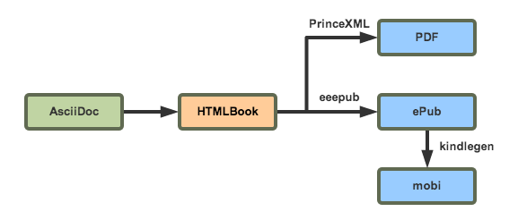

# persie

## 作用

电子书工具链。

## 特性

### 一出四

一个文稿源，生成四种格式电子书：PDF，ePub，mobi 和静态网站。

## 原理

## 用法

参见[用户手册](http://andorchen.github.io/persie-manual/)。

## FAQ

**问：为什么开发这个程序？**

答：我有生成电子书的需求，而目前市面上并没有合我心意的类似工具。我在挠自己的痒处。

**问：为什么没有“那个”功能？**

答：我只知道我自己哪里痒，不知道你哪里痒。如果你也痒，请[告诉](https://github.com/AndorChen/persie/issues)我你痒在何处。我可以给你挠，但不保证能为你止痒。

**问：使用中遇到问题怎么办？**

答：首先我很抱歉，因为我能力有限，无法保证不出问题。如果遇到问题，而你自己无法解决，或许你可以[告诉](https://github.com/AndorChen/persie/issues)我，咱们一起解决。

**问：生成的电子书好难看，你得做点儿什么！**

答：精力有限，暂时不打算提供基础样式。如果你有迫切的需求，做好预算后随时可以[联系](mailto:andor.chen.27@gmail.com)我。

**问：我很喜欢这个工具，想表示表示，该怎么做？**

答：不会吧，烂成这样的程序！好吧，如果你真想表示一下，那就买本[我翻译的书](https://selfstore.io/~andor)吧。

## 作者

[Andor Chen](http://about.ac)

## 协议

[MIT](LICENSE)

